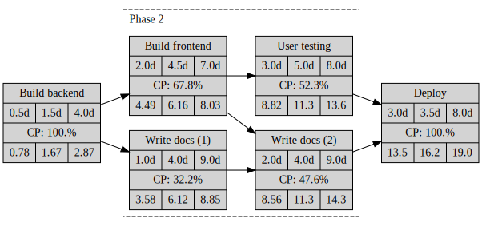

# ernie

[PERT](https://en.wikipedia.org/wiki/Program_evaluation_and_review_technique) Project planning in Haskell

This is driven by my own needs / ideas about planning. Look at the source code of `Ernie.Example` to get started.

## Features (planned)

[ ] Critical path: end 2 end, milestones
[ ] Project start / end / duration
[ ] Export samples to CSV

Maybe features

[ ] Resource planning (maybe?)
[ ] Combine plan with progress data

## Contributing

Contributions are welcome!
